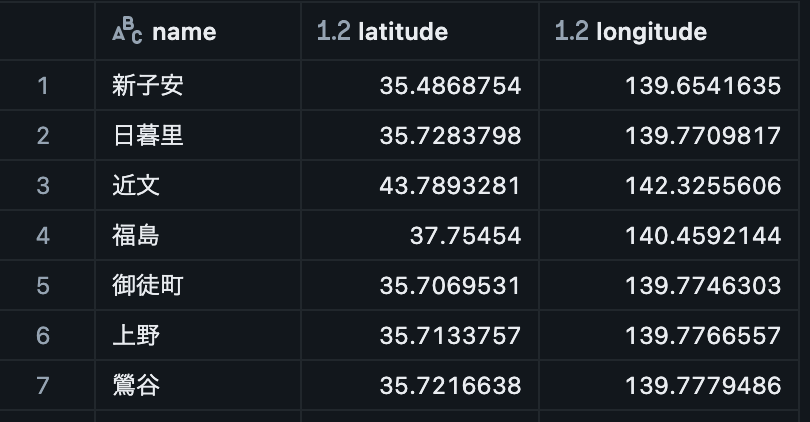
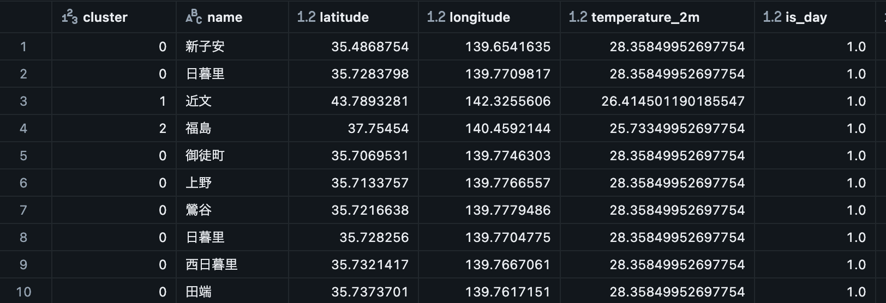
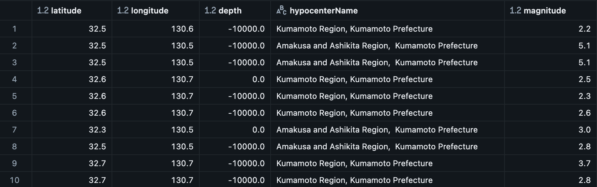

# Japan Weather ETL

### Deployment Summary
This repository creates a data pipeline Japan weather or events centered around train stations.

Two versions exist for learning different pipelines
- GCP - [GCP](gcp)
- Databricks - [Databricks](databricks)

Readme and installation instructions exist within each sub folder.

For both deployment scenarios, the following data is integrated:
-   Station data:
    -   API: http://overpass-api.de/
    -   Requested data
        -   Station name
        -   Latitude
        -   Longitude
-   Earthquake data
    -   API: https://www.jma.go.jp/bosai/quake/data/list.json
    -   Requested data
        -   Earthquake event data
-   Weather data:
    -   API: https://open-meteo.com/en/docs/jma-api
    -   Requested data
        -   Temperature
        -   Day or night
        -   Precipitation
        -   Wind speed
        -   Wind direction

# Data flow
The following shows images of the Databricks pipeline, however the GCP setup is relatively similar.

The data flow of the pipeline can be seen in the figure below.


The pipeline begins by parsing the parquet file for a list of train stations. This list is created from an OpenStreetMap (OSM) dataset, and uploaded to a volume. This parses the dataset, and creates a stations table.



Once parsed, the stations are grouped using DBSCAN to find clusters of train stations. This helps limit the API calls to OpenMeteo weather API, by only grabbing weather for a selected representative within that cluster. For each of the clusters, weather such as temperature, wind speed, and precipitation are obtained, and reassigned to each station within the cluster.



Seperately, earthquake events are pulled from the JMA quake API by parsing JSON files on the website, once parsed, these files are parsed into a earthquake table.



Finally, once all initial tables are created, silver and gold tables are created from the base tables by filtering out troublesome rows, nulls, etc.

# Deployment Steps (Databricks)
1. Databricks DABs are used to deploy the pipeline, a YAML file is created to deploy this pipeline [dab](databricks/databricks.yaml)
2. Run the SQL commands to create catalog, schema, volumes [create-env.sql](databricks/create-env.sql)
3. Due to newer OSM API requirements, a parquet file  should be uploaded to a volume, then referenced in 
4. Deployment steps as follows:
   ```bash
   databricks bundle validate
   ```
   ```bash
   databricks bundle deploy
   ```

# Deployment Steps (GCP)
1. Build docker image

```bash
docker build -t japan-weather-etl .
```

2. Test run the image locally (optional)

```bash
docker run --rm -it japan-weather-etl
```

3. Check raw files written (optional)

```bash
docker run --rm -it japan-weather-etl ls -l /app/data/raw/
```

4. Authenticate to GCloud for terraform
```bash
gcloud auth application-default login
```

5. Create docker repository in Artifact Registry
```bash
gcloud artifacts repositories create weather-etl-repo --repository-format=docker --location=<REGION> --description="Weather ETL repository"
    
gcloud artifacts repositories list
```

5. Submit docker image for Cloud Build
```bash
gcloud builds submit --region=<REGION> --tag <REGION>-docker.pkg.dev/PROJECT_ID/weather-etl-repo/japan-weather-etl:tag1 
```

6. Setup terraform variables file (_terraform.tfvars_) with the following set:
```
project = ""
region = ""
location = ""
```

7. Deploy using terraform
```bash
cd terraform-backend
terraform init
terraform apply
```

8. Trigger function once to create parquet
Trigger the cloud run function in gcp once to create a parquet file

9. Deploy front end
```bash
cd terraform-frontend
terraform init
terraform apply
```